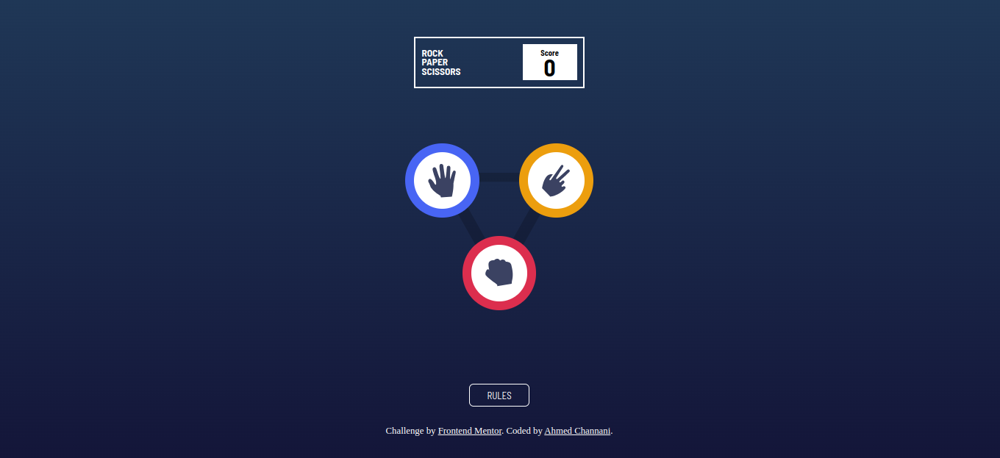

# Frontend Mentor - Rock, Paper, Scissors solution

This is a solution to the [Rock, Paper, Scissors challenge on Frontend Mentor](https://www.frontendmentor.io/challenges/rock-paper-scissors-game-pTgwgvgH). Frontend Mentor challenges help you improve your coding skills by building realistic projects. 

## Table of contents

- [Overview](#overview)
  - [The challenge](#the-challenge)
  - [Screenshot](#screenshot)
  - [Links](#links)
- [My process](#my-process)
  - [Built with](#built-with)
  - [What I learned](#what-i-learned)
  - [Continued development](#continued-development)
- [Acknowledgments](#acknowledgments)

## Overview
This a Rock Paper Scissors game made by HTML,CSS and Javascript.
This project was build by Ahmed Channani.
### The challenge

Users should be able to:

- View the optimal layout for the game depending on their device's screen size
- Play Rock, Paper, Scissors against the computer
- Maintain the state of the score after refreshing the browser _(optional)_

### Screenshot

### Links

- Solution URL: [Add solution URL here](https://your-solution-url.com)
- Live Site URL: [Add live site URL here](https://your-live-site-url.com)

## My process
I used the mobile first approach to build this prject, i build the main page and then added the rules page and made it works proppel. Next i started building the transition pages of the game and made sure everything functions well.
### Built with

- Semantic HTML5 markup
- CSS custom properties
- Flexbox
- CSS Grid
- Mobile-first workflow
- Javascript

### What I learned
in this project i learned more about the dom manupluation using javascpript, and also learned more about how html,css and javascript can work together.

Also, thid project helped enhance my coding skills and programming knowledge when it comes to the web and really gave the confidence to build more advanced projects.

### Continued development
For the future, i see this project allowing 1v1 instead of just plaing vs the computer and this game to be available in other platforms other than only the browser and be available on the phone and other platforms.

## Acknowledgments
Thanks to my friend zakaria who helped me with this project.

>>>>>>> master
